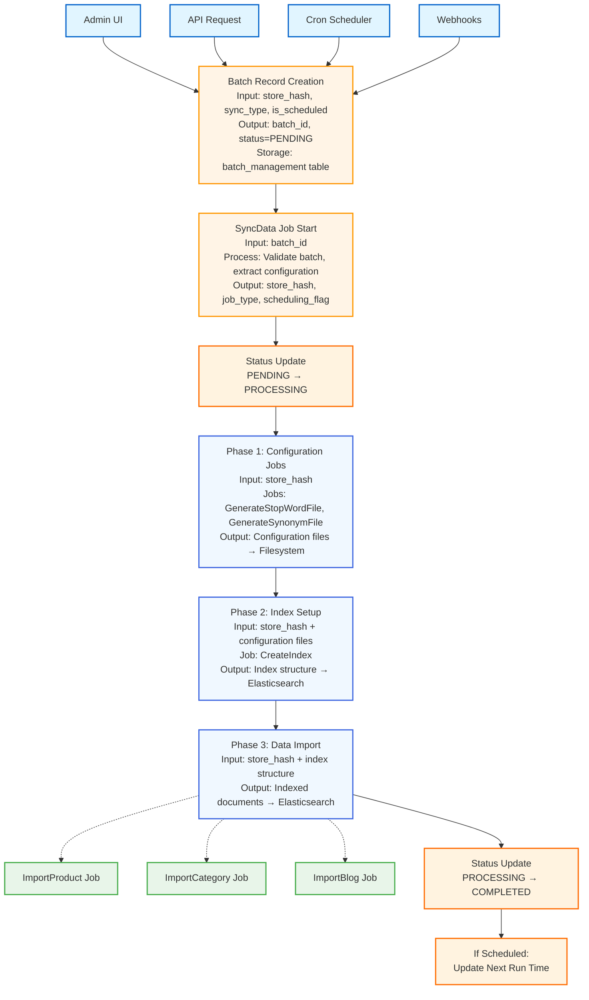

# Data Flow Specification: SyncData Job

## Overview

This document describes how data flows through the Sync Data job system, from initial trigger to final completion. It maps the journey of data through various stages, transformations, and system boundaries.

## Data Flow Diagram



## Detailed Data Flow by Stage

### Stage 1: Batch Creation

**Data Source:** User action, API call, cron trigger, or webhook event

**Input Data:**
| Field | Type | Description | Example |
|-------|------|-------------|---------|
| store_hash | string | BigCommerce store identifier | "abc123xyz" |
| type | integer | Sync job type | 1 (ALL) |
| is_scheduled | boolean | Recurring sync flag | true/false |

**Process:**
1. Validate input parameters
2. Generate unique batch_id
3. Set initial status to PENDING
4. Store batch record in database

**Output Data:**
| Field | Type | Description |
|-------|------|-------------|
| id | string/UUID | Unique batch identifier |
| store_hash | string | Store identifier (stored) |
| type | integer | Job type (stored) |
| status | string | Initial status = "PENDING" |
| is_scheduled | boolean | Scheduling flag (stored) |
| created_at | timestamp | Creation time |

**Data Storage:** `batch_management` table

---

### Stage 2: Job Initialization

**Data Source:** Queue system delivers job with batch_id

**Input Data:**
| Field | Type | Source |
|-------|------|--------|
| batch_id | string | Job parameter |

**Process:**
1. Query batch record from database using batch_id
2. Validate batch exists
3. Validate status equals PENDING
4. Extract batch configuration

**Data Retrieval:**
```
Database Query: SELECT * FROM batch_management WHERE id = {batch_id}
```

**Output Data:**
| Field | Type | Used For |
|-------|------|----------|
| batch_id | string | Logging, status updates |
| store_hash | string | Passed to worker jobs |
| job_type | integer | Determines which jobs to dispatch |
| is_scheduled | boolean | Determines if cron update needed |

**Data Flow:**
- **Read:** 1 database query (batch record)
- **Write:** 1 database update (status → PROCESSING)

---

### Stage 3: Configuration Generation (Phase 1)

**Triggered When:** job_type is ALL or GENERATE_STOP_WORD_FILE or GENERATE_SYNONYM_FILE

**Job 1: Generate Stop Word File**

**Input:**
- store_hash (from SyncData)

**Data Sources:**
- Store-specific stop word configurations (database/config)
- Default stop word lists

**Processing:**
1. Fetch store-specific stop words from database
2. Merge with default stop words
3. Format for Elasticsearch compatibility
4. Generate file content

**Output:**
- File: `/path/to/elasticsearch/config/{store_hash}/stopwords.txt`
- Format: Plain text, one word per line

**Example Output:**
```
the
and
or
a
an
```

**Job 2: Generate Synonym File**

**Input:**
- store_hash (from SyncData)

**Data Sources:**
- Store-specific synonym mappings (database)
- Default synonym rules

**Processing:**
1. Fetch synonym rules from database
2. Format for Elasticsearch synonym filter
3. Generate file content

**Output:**
- File: `/path/to/elasticsearch/config/{store_hash}/synonyms.txt`
- Format: Elasticsearch synonym format

**Example Output:**
```
phone, mobile, cell phone
laptop, notebook, computer
```

**Data Flow Summary:**
- **Input:** store_hash
- **Read:** Store configuration from database
- **Write:** Configuration files to filesystem
- **Dependencies:** None (can run independently)

---

### Stage 4: Index Creation (Phase 2)

**Triggered When:** job_type includes any import operation (PRODUCT, CATEGORY, BLOG, or ALL)

**Job: Create Index**

**Input:**
- store_hash (from SyncData)

**Data Sources:**
- Configuration files from Phase 1
- Index mapping templates (application config)
- Elasticsearch cluster

**Processing:**
1. Check if index exists for store
2. Load index mapping template
3. Reference stop word and synonym files
4. Create or update index structure

**Index Structure Created:**
```
Index Name: product-{store_hash}
Index Name: suggestion-{store_hash}
```

**Index Configuration:**
- Mappings: Field types, analyzers
- Settings: Shards, replicas, analyzers
- Analyzers: Custom analyzers using stop words/synonyms

**Output:**
- Index structure in Elasticsearch
- Index ready to receive documents

**API Calls:**
- Elasticsearch: `PUT /{index_name}` with mapping configuration

**Data Flow Summary:**
- **Input:** store_hash + configuration files
- **Read:** Configuration files from filesystem
- **Write:** Index structure to Elasticsearch
- **Dependencies:** Requires configuration files from Phase 1

---

### Stage 5: Data Import (Phase 3)

All three import jobs run **in parallel** and independently.

#### Job 1: Import Product

**Input:**
- store_hash (from SyncData)

**Data Sources:**
- BigCommerce Products API
- BigCommerce Product Images API
- BigCommerce Product Variants API

**Processing Flow:**

1. **Fetch Data from BigCommerce**
   - API Endpoint: `/v3/catalog/products`
   - Pagination: Fetch in batches (50-250 products per request)
   - Related data: Variants, images, custom fields

2. **Transform Data**
   - Extract relevant fields (name, description, price, SKU, etc.)
   - Flatten nested structures
   - Format for search optimization
   - Calculate derived fields (price range, availability)

3. **Index Documents**
   - Batch documents (typically 100-1000 per request)
   - Send to Elasticsearch bulk API
   - Index: `product-{store_hash}`

**Data Transformation Example:**

**BigCommerce API Response:**
```json
{
  "id": 123,
  "name": "Smartphone X",
  "price": 699.99,
  "categories": [45, 67],
  "variants": [...]
}
```

**Transformed for Elasticsearch:**
```json
{
  "product_id": 123,
  "name": "Smartphone X",
  "search_keywords": "smartphone x mobile phone",
  "price": 699.99,
  "category_ids": [45, 67],
  "in_stock": true,
  "image_url": "...",
  "indexed_at": "2026-02-11T10:30:00Z"
}
```

**Output:**
- Indexed product documents in Elasticsearch
- Total count: All products from store

**API Calls:**
- BigCommerce: Multiple GET requests (paginated)
- Elasticsearch: `POST /_bulk` (batch indexing)

#### Job 2: Import Category

**Input:**
- store_hash (from SyncData)

**Data Sources:**
- BigCommerce Categories API
- BigCommerce Pages API (web content)

**Processing Flow:**

1. **Fetch Categories**
   - API Endpoint: `/v3/catalog/categories`
   - Includes category tree structure

2. **Fetch Pages**
   - API Endpoint: `/v2/pages`
   - Includes static web pages

3. **Transform & Combine**
   - Merge categories and pages
   - Normalize data structure
   - Add search metadata

4. **Index Documents**
   - Index: `suggestion-{store_hash}`

**Output:**
- Indexed category and page documents

**API Calls:**
- BigCommerce: GET categories, GET pages
- Elasticsearch: `POST /_bulk`

#### Job 3: Import Blog

**Input:**
- store_hash (from SyncData)

**Data Sources:**
- BigCommerce Blog API or custom blog system

**Processing Flow:**

1. **Fetch Blog Posts**
   - Fetch all published blog posts
   - Include metadata (author, date, tags)

2. **Transform Data**
   - Extract searchable content
   - Format metadata
   - Add search optimization

3. **Index Documents**
   - Index: `suggestion-{store_hash}`

**Output:**
- Indexed blog post documents

**Data Flow Summary (All Import Jobs):**
- **Input:** store_hash
- **Read:** Data from BigCommerce API (external)
- **Transform:** Raw API data → Search-optimized documents
- **Write:** Documents to Elasticsearch (external)
- **Dependencies:** Requires index from Phase 2
- **Execution:** Parallel (independent operations)

---

### Stage 6: Completion & Finalization

**Trigger:** All job dispatches complete (success or failure)

#### Success Path

**Process:**
1. Update batch status to COMPLETED
2. If is_scheduled = true:
   - Calculate next run time
   - Update cron_management record

**Data Updates:**
```
batch_management:
  status: PROCESSING → COMPLETED
  completed_at: current_timestamp

cron_management (if scheduled):
  next_run: current_timestamp + interval
```

**Output:**
- Batch marked complete in database
- Next sync scheduled (if applicable)

#### Failure Path

**Process:**
1. Capture exception details
2. Log error with context
3. Update batch status to FAILED
4. Re-throw exception for queue retry

**Data Updates:**
```
batch_management:
  status: PROCESSING → FAILED
  error_message: exception details
  failed_at: current_timestamp
```

**Logged Data:**
- Batch ID
- Store Hash
- Exception message
- Stack trace
- Timestamp

**Output:**
- Batch marked failed in database
- Error logged for investigation
- Job queued for retry (if retry limit not reached)

---

## Data Flow by System Boundary

### Internal System (SyncData Job)

**Data In:**
- batch_id (from queue)

**Data Out:**
- Worker job dispatches (to queue)
- Status updates (to database)
- Logs (to logging system)

**Data Stores:**
- Read: batch_management table
- Write: batch_management table, cron_management table

### External Systems

#### BigCommerce API

**Direction:** Worker Jobs → BigCommerce (READ)

**Data Retrieved:**
- Product catalog data
- Category structures
- Blog posts
- Store configuration

**API Rate Limits:**
- Standard: 20,000 requests/hour
- Enterprise: Higher limits

**Data Format:** JSON (REST API)

#### Elasticsearch

**Direction:** Worker Jobs → Elasticsearch (WRITE)

**Data Written:**
- Product documents
- Category documents
- Blog documents
- Index mappings/settings

**Data Format:** JSON (Elasticsearch REST API)

**Indexing Rate:** Depends on cluster size (typically 1000-10000 docs/sec)

---

## Data Transformations

### Batch Configuration → Job Parameters

**Input:**
```
{
  "batch_id": "uuid-123",
  "store_hash": "abc123",
  "type": 1,  // ImportJobType::ALL
  "is_scheduled": true
}
```

**Output:**
```
For each worker job:
  - store_hash: "abc123"

For completion:
  - update_cron: true
```

### Job Type → Job Dispatch Matrix

| Input Type | Dispatched Jobs |
|------------|----------------|
| ALL (1) | StopWord, Synonym, CreateIndex, Product, Category, Blog |
| IMPORT_PRODUCT | CreateIndex, Product |
| IMPORT_CATEGORY | CreateIndex, Category |
| IMPORT_BLOG | CreateIndex, Blog |
| GENERATE_STOP_WORD_FILE | StopWord only |
| GENERATE_SYNONYM_FILE | Synonym only |

### BigCommerce Product → Elasticsearch Document

**Transformation Steps:**
1. **Field Mapping:** API fields → Search fields
2. **Enrichment:** Add computed fields (search score, facets)
3. **Optimization:** Create searchable text fields
4. **Normalization:** Standardize formats (dates, prices)

**Example:**
```
API Field "description_html" → ES Field "description" (HTML stripped)
API Field "price" → ES Fields ["price", "price_range", "price_facet"]
API Fields ["name", "sku", "description"] → ES Field "search_text" (combined)
```

---

## Data Dependencies

### Sequential Dependencies

```
Configuration Files
        ↓ (must exist before)
Index Creation
        ↓ (must complete before)
Data Import
```

**Why:**
- Configuration files define index behavior
- Index must exist to receive documents
- Breaking this order causes failures

### Parallel Operations

```
Import Product ─┐
Import Category ├─→ (can run simultaneously)
Import Blog ────┘
```

**Why:**
- Independent data sources (different API endpoints)
- Independent data targets (different ES indices)
- No shared state or resources

---

## Data Volume & Performance

### Typical Data Volumes

| Entity | Typical Count | Large Store |
|--------|--------------|-------------|
| Products | 100-5,000 | 50,000+ |
| Categories | 10-100 | 500+ |
| Pages | 5-50 | 200+ |
| Blog Posts | 0-100 | 1,000+ |

### Data Transfer

**Per Full Sync (Medium Store):**
- From BigCommerce: 50-500 MB
- To Elasticsearch: 100-1000 MB (with search metadata)
- Configuration files: < 1 MB

### Processing Time

**SyncData Job:** < 1 second (only dispatches)

**Worker Jobs:**
- Configuration: 1-5 seconds
- Index Creation: 5-30 seconds
- Product Import: 2-60 minutes (depends on volume)
- Category Import: 1-10 minutes
- Blog Import: 1-5 minutes

**Total Sync Time (Medium Store):** 5-70 minutes

---

## Data Quality & Validation

### Input Validation

**Batch Creation:**
- store_hash must be valid format
- type must be valid ImportJobType enum value
- store must exist in system

**SyncData Execution:**
- Batch must exist
- Status must be PENDING
- No concurrent processing of same batch

### Data Integrity

**Consistency Checks:**
- All API data fetched (pagination complete)
- All documents indexed (count verification)
- No data loss during transformation

**Error Recovery:**
- Failed API calls → Retry with backoff
- Failed indexing → Retry batch
- Failed job → Queue retry mechanism

---

## Monitoring Data Flow

### Key Metrics

**Data Ingestion:**
- Records fetched from BigCommerce
- Documents indexed to Elasticsearch
- Failed records count

**Data Freshness:**
- Last successful sync timestamp
- Data age (time since last update)
- Sync frequency

**Data Quality:**
- Missing fields count
- Transformation errors
- Index errors

### Logging

**Data Points Logged:**
- Batch ID (trace identifier)
- Store Hash (grouping)
- Job type (context)
- Status transitions (lifecycle)
- Error details (debugging)
- Timestamps (performance)

---

## Summary

The SyncData job orchestrates a complex data flow from BigCommerce stores to Elasticsearch search indices. Data flows through three main phases:

1. **Configuration:** Store settings → Filesystem
2. **Structure:** Index mappings → Elasticsearch
3. **Content:** Store data → Elasticsearch documents

The architecture ensures proper sequencing through phased execution while maximizing throughput through parallel import operations. Understanding this data flow is essential for troubleshooting sync issues, optimizing performance, and ensuring data quality.
